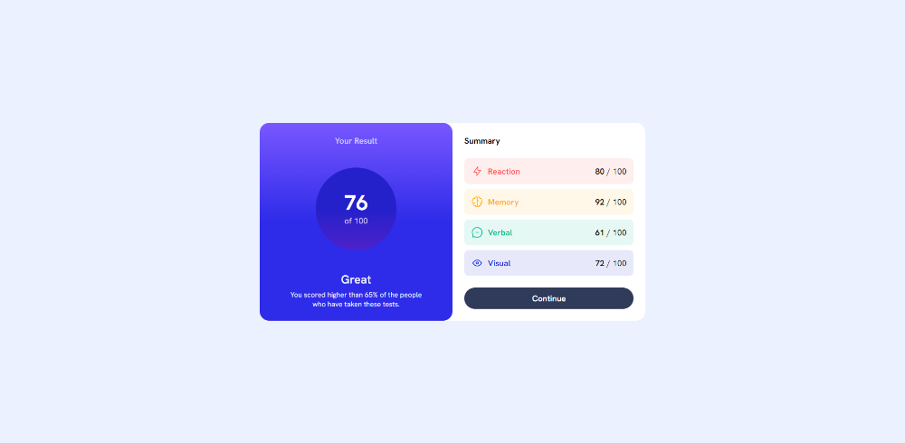
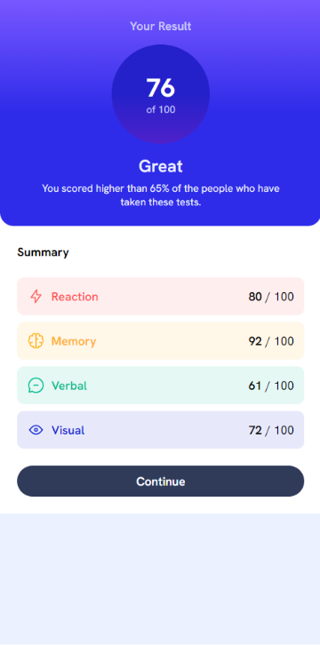

# Frontend Mentor - Results summary component solution

This is a solution to the [Results summary component challenge on Frontend Mentor](https://www.frontendmentor.io/challenges/results-summary-component-CE_K6s0maV). Frontend Mentor challenges help you improve your coding skills by building realistic projects.

## Table of contents

- [Overview](#overview)
  - [The challenge](#the-challenge)
  - [Screenshot](#screenshot)
  - [Links](#links)
- [My process](#my-process)
  - [Built with](#built-with)
  - [What I learned](#what-i-learned)
- [Author](#author)

## Overview

### The challenge

Users should be able to:

- View the optimal layout for the interface depending on their device's screen size
- See hover and focus states for all interactive elements on the page

### Screenshot

### Links

- Solution URL: [https://github.com/lcabrera13/results-summary-component-solution](https://github.com/lcabrera13/results-summary-component-solution)
- Live Site URL: [https://results-summary-component-solution-wheat.vercel.app/](https://results-summary-component-solution-wheat.vercel.app/)

## My process

### Built with

- [React](https://reactjs.org/) - JS library
- [Next.js](https://nextjs.org/) - React framework
- [Tailwind CSS](https://tailwindcss.com/) - For styles

### What I learned

I did this project to reinforce my knowledge in Next.js and Tailwind CSS.

## Author

- Website - [Luis Cabrera](https://lcabrera13.github.io/)
- Frontend Mentor - [@lcabrera13](https://www.frontendmentor.io/profile/lcabrera13)
- GitHub - [@lcabrera13](https://github.com/lcabrera13)
